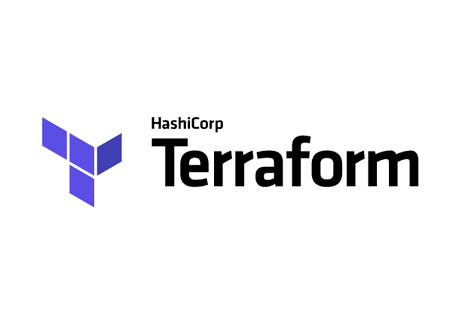

# Stage1: Terraform-vmware
Automatic Deploy Virtual Machines on VMware DataCenter using Terraform

***

**This is an example of deploying one Centos7 virtual machine on existing VMware infrastructure.**

Terraform is an automation tool created by HashiCorp. It focuses on deploying cloud infrastructure in an automatic fashion. It supports a lot of cloud providers like AWS, DigitalOcean, Google Cloud Platform, OpenStack, VMware vSphere, and more. Terraform is developed in GoLang, which makes the installation really easy to perform, and allows for a lot of operating systems to be supported.

  

**Preriquisites**

For this lab we will see how to deploy a VMware vSphere virtual machine with Terraform, therefore we obviously need a working VMware vSphere environment (vCenter and ESXi). We will use a Linux client machine (Ubuntu 16.04), but the installation of Terraform on another platform should be straightforward.

